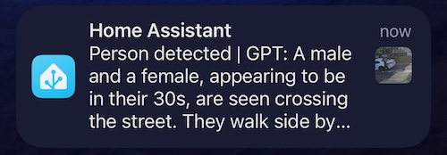
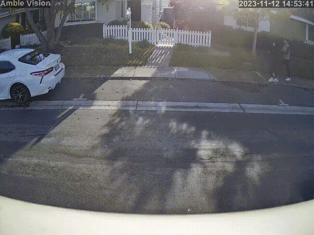
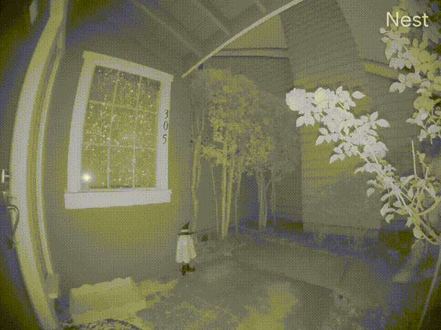

# AmbleGPT

Video surveilance footage analyst powered by GPT-4 Vision.

## Summary

AmbleGPT is activated by a Frigate event via MQTT and analyzes the event clip using the OpenAI GPT-4 Vision API. It returns an easy-to-understand, context-rich summary. AmbleGPT then publishes this summary text in an MQTT message. The message can be received by the Home Assistant Frigate Notification Automation and sent to a user via iOS/Android notifications.


## Demo




More video examples:

| Video        | GPT Summary    |       
| ------------- |:-------------:|
|          | A male and a female, appearing to be in their 30s, are seen crossing the street from the left to the right. They walk side by side and are visible for a total of 18 seconds.|
|       | A female, approximately 30 years old and 1.65 meters tall, is seen approaching and standing at the front door, looking down momentarily and then preparing to interact with the person who might open the door |


## Features

**Configurable Prompts**
You will be able to update the prompt to fit your specific needs – simply ask the analyst using natural language!

For example, the [default prompt](https://github.com/mhaowork/amblegpt/blob/main/mqtt_client.py#L39-L71) attempts to estimate the number of humans detected, as well as their age, height, and gender.


**Image Compression to Reduce API Cost**

OpenAI charges by tokens, which in this case are pixels. This project resizes the footage to help you save on API costs.


## Prerequisites 

* Frigate https://github.com/blakeblackshear/frigate
  * Currently Frigate is the only supported NVR. 
   
* Frigate <> Home Assistant Integration: https://docs.frigate.video/integrations/home-assistant
  * To receive notifications which contain the AmbleGPT generated event analysis.


## Installation

### Preparation

AmbleGPT utilizes the OpenAI API, and you will need to configure it with your own OpenAI API key which will cost a bit money. For example, it costs 0.01 USD to process a video clip around 30s currently, assuming sampling frames every 3 seconds resulting in 10 frames.

### Run AmbleGPT
Docker is recommended.

```shell
docker run -d --name amblegpt \
    --restart unless-stopped \
    -e OPENAI_API_KEY="YOUR_OPENAI_API_KEY"
    -e FRIGATE_SERVER_IP="YOUR_FRIGATE_IP" \
    -e FRIGATE_SERVER_PORT="5000" \
    -e MQTT_BROKER="YOUR_MQTT_BROKER_IP" \
    -e MQTT_PORT="1883" \
    mhaowork/amblegpt
```

Alternatively, you can simply install deps in `requirements.txt`, set `.env` and run `mqtt_client.py`.


### Frigate Notifications via Home Assistant Blueprint

Import this Blueprint: https://github.com/mhaowork/HA_blueprints/tree/main

If you already have SgtBatten/HA_blueprints, you will need to manually edit its YAML in Home Assistant following [this guide](https://www.home-assistant.io/docs/automation/using_blueprints/#keeping-blueprints-up-to-date) and  copy [this file](https://github.com/mhaowork/HA_blueprints/blob/main/Frigate%20Camera%20Notifications/Stable) over. This new file contains a new subscriptoin to AmbleGPT's MQTT messages and inserts GPT generated summaries in notifications.


**That's it for the installation!**

Note, the processing time for each video clip, which includes decoding and processing, varies based on the CPU speed of your host machine and OpenAI API round-trip time. So in reality, you will see one notification first which includes the usual static message like "Person Detected - Front camera". Then after a delay, the notification text will update automatically to show the AmbleGPT summary.


## Future Work
1. Allow easier prompt customization
2. Further reduce tokens required to process a clip
